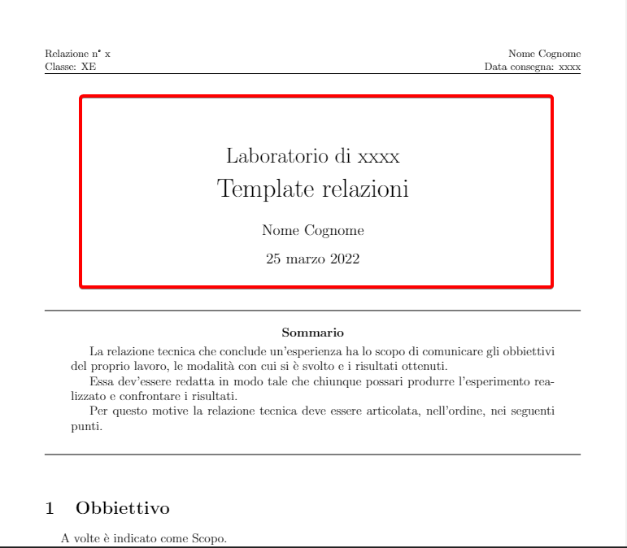
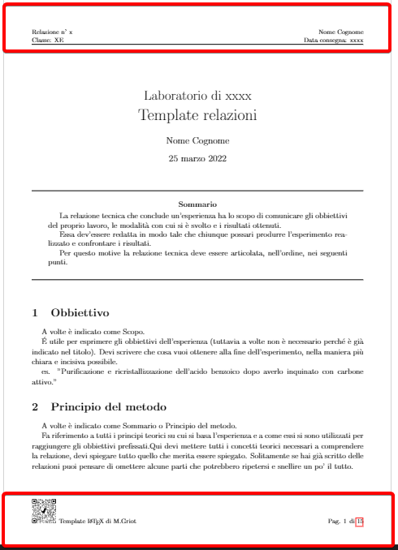
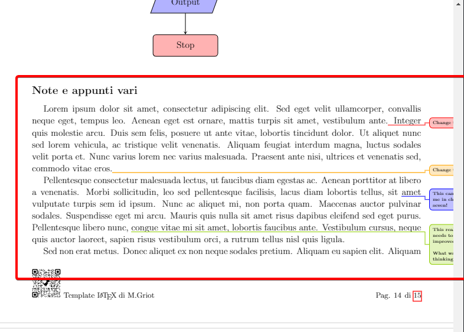
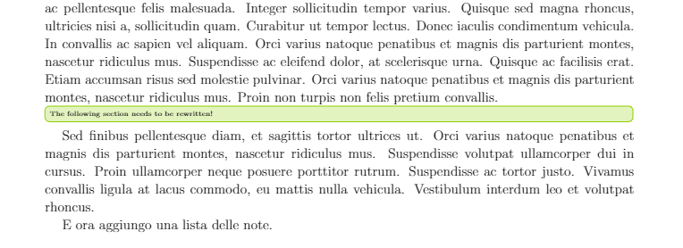
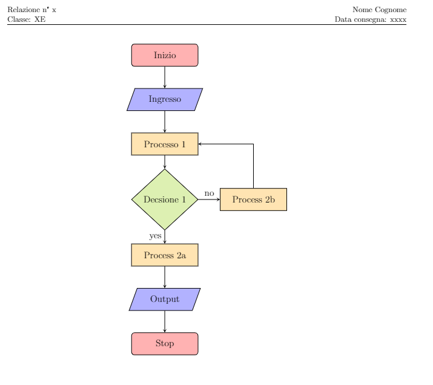

# Template-relazione-LaTex

- [Template-relazione-LaTex](#template-relazione-latex)
  - [Introduzione](#introduzione)
  - [main.tex](#maintex)
  - [settings.tex](#settingstex)
  - [package.tex](#packagetex)
  - [bibliography.bib](#bibliographybib)
  - [img/](#img)
  - [section/](#section)


Questo che vedete è un template per scrivere le relazioni di laboratorio in LaTex, ha un impronta prevalentemente chimica ma può essere adattato a qualsiasi esigenza.
Un esempio di questo template è disponibile a [Template_relazioni](https://github.com/MGriot/Template-relazione-LaTex/blob/master/.out/main.pdf).

Questa guida però non vuole essere un tutorial su come si scriva in LaTex e quindi da per scontato che sappiate come si scrive un file LaTex.
## Introduzione

Il template è strutturato in maniera da poter scrivere comodamente una relazione suddividendo ogni sezione in un file diverso collocato nella cartella `section`.
Ci sono però dei file di più grande importanza che vengono elencati qua sotto e affrontati in una sezione apposita uno per volta.

* `main`
* `config/settings`
* `config/package`
* `bibliography`
* `img/`
* `section/`

## main.tex

In questo file, cuore pulsante del template trovi nelle prime righe:

```LaTex
\documentclass[a4paper]{article} %struttura del file
\usepackage[utf8]{inputenc}

\input{config/package} %package utilizzati
\input{config/settings} %file con settaggi
```

`\input{config/package}` indica dove sono collocati tutti i package utilizzati per la costruzione del file di output, è da modificare solo se si sa cosa si sta facendo perchè l'eleiminazione dei pacchetti può compromettere la corretta composizione del `main.tex`.

`\input{config/settings}` è invece la parte che dà lo stile al file finale, qui sono contenute le impostazioni, i comandi e le impostazioni dei pacchetti usati. Verrà analizzato nel dettaglio in una sezione apposita.

Continuando a scorrere il file ci si imbatte in:

```LaTex
%Nome e Cognome 
\def \nome {Nome}
\def \cognome {Cognome}

%titolo e data
\title{Laboratorio di xxxx \\ \huge{Template relazioni}}
\author{\nome \ \cognome}
\date{\today}
```

In `\def \nome {Nome}` e `\def \cognome {Cognome}`, al posto di Nome  e Cognome dentro parentesi graffe "`{}`" va messo il nome e il cognome dell'autore del documento. Questo andrà a collocare il nome e cognome dell'autore in tutte le parti in cui è necessario all'interno del documento.

Per quanto riguarda `\title{Laboratorio di xxxx \\ \huge{Template relazioni}}` è il comando che permette la creazione del titolo, al posto di _"xxxx"_ va messo il nome della materia, in caso di necessità può essere cambiata tutta la parte _"Laboratorio di xxxx"_. Il secondo pezzo, invecem è il titolo vero e proprio e quindi bisogna sostituire _"Template relazioni"_ con il proprio titolo.

`\date{\today}` Inserisce la data di compilazione del file, generalmente però conviene mettere la data di svolgimento dell'esperienza che si vuole riportare.

Questa prima parte in particolare va a formare tutto quello che è racchiuso nel rettangolo in rosso nell'immagine sottostante:



Subito dopo viene una parte importante che definisce la testatina e il piedipagina.

```LaTex
%page style
\pagestyle{fancy}
\fancypagestyle{plain}{}
\fancyhf{}
\rhead{\nome \ \cognome \\ Data consegna: xxxx}
\lhead{Relazione n° x \\ Classe: XE}
\rfoot{Pag. \thepage \hspace{1pt} di \pageref{LastPage}}
\lfoot{\includegraphics[scale=0.1]{img/GitHub/qrcode_github.com.png} Template \LaTeX \;di M.Griot}
\setlength{\headheight}{22.54448pt}
```

`\rhead{\nome \ \cognome \\ Data consegna: xxxx}` si occupa di andare a mettere il nome e il cognome dell'autore, questa parte in automatico, e la data di consegna nella testatina del documento di ogni pagina. Per la data occorre mettere al posto di _"xxxx"_ la data di consegna della relazione. Questo serve per avere un tracciamento migliore dello svolgimento delle attività di laboratorio.

La riga `\lhead{Relazione n° x \\ Classe: XE}` permette di srivere il numero della relazione, nel caso si scrivessero più relazioni nel corso del tempo, occorre sostituire _"x"_ con il numero corretto. Vi è anche la possibilità di inserire la classe o corso andado a modificare _"Classe: XE"_ con quella vostra.

`\rfoot{Pag. \thepage \hspace{1pt} di \pageref{LastPage}}`, invece, va a scrivere il numero di pagina a pie di pagina destro mettendo il numero della pagina corrente e il numero totale di pagine, utile se si ha paura che alcuni fogli possano essere persi. Si consiglia di non modificare più di tanto.

`\lfoot{\includegraphics[scale=0.1]{img/GitHub/qrcode_github.com.png} Template \LaTeX \;di M.Griot}` è la penultima riga e crea in basso a sinistra un QRcode con il link a questa pagina e indica l'autore del template. Nel caso non si voglia quest'aggiunta basta eliminare per intero la riga. Ovviamente, qualora venga utilizzato questo template fa piacere che venga riportato l'indirizzo di questa pagina o il nome del suo autore ma la decisione spetta a te!

L'utlima riga, `\setlength{\headheight}{22.54448pt}`, sistema l'altezza della testatina e il pie di pagina e si consiglia di non modificare.

Questa seconda parte va a formare tutto quello che è racchiuso nei rettangoli in rosso nell'immagine sottostante:



In ultimo viene la sezione del testo vero e proprio.

```LaTex
\hypersetup{pdftitle={Template Example}, pdfauthor={\cognome \; \nome}}

\begin{document}

\maketitle 
\input{section/0_Sommario} 
\input{section/1_Obbiettivo}
\input{section/2_Principio_del_metodo}
\input{section/3_Strumenti}
\input{section/4_Reagenti}
\input{section/5_Procedimento}
\input{section/6_Reazioni}
\input{section/7_Dati_e_Calcoli}
\input{section/8_Conclusioni}
\input{section/9_Bibliografia}
\input{section/10_H_e_P_frasi} 

\input{section/link_utili}
\input{section/esempi}
\end{document}
```

La prima riga `\hypersetup{pdftitle={Template Example}, pdfauthor={\cognome \; \nome}}` serve per mostrare il nome del file e l'autore come proprietà del pdf generato.

`\maketitle` consente di costruire la sezione di Titolo che prima abbiamo discusso. Non va cencellata altrimenti il titolo del documento sparirebbe.

Tutte le righe comprese tra `\maketitle` e `\end{document}` sono tutte le sezioni che vengono importate per comporre il documento. Quelle che vedono un numero prima del nome, es `\input{section/1_Obbiettivo}`, sono da mantenere, in base alla necessità, mentre le ultime due righe si possono cancellare in quanto caricano del testo utile al Template ma inutile al fine di una relazione.

## settings.tex

Questo file che si raggiunge tramite il percorso: `config/settings` è il file dedicato a tenere le informazioni e preferenze per la costruzione del documento.
Le linee di codice che lo compongono sono poche e semplici.

```LaTex
%%%%%Colors
\definecolor{red}{RGB}{255,0,0}
\definecolor{orange}{RGB}{255,165,0}
\definecolor{blue}{RGB}{0,0,255}
\definecolor{green}{RGB}{143,206,0}

%%%%%%%%%% ToDo notes
% \usepackage[colorinlistoftodos,prependcaption,textsize=tiny,disable]{todonotes}
\newcommandx{\unsure}[2][1=]{\todo[linecolor=red,backgroundcolor=red!25,bordercolor=red,#1]{#2}}
\newcommandx{\change}[2][1=]{\todo[linecolor=orange,backgroundcolor=orange!25,bordercolor=orange,#1]{#2}}
\newcommandx{\info}[2][1=]{\todo[linecolor=blue,backgroundcolor=blue!25,bordercolor=blue,#1]{#2}}
\newcommandx{\improvement}[2][1=]{\todo[linecolor=green,backgroundcolor=green!25,bordercolor=green,#1]{#2}}
\newcommandx{\thiswillnotshow}[2][1=]{\todo[disable,#1]{#2}}

%per flowchart
\tikzstyle{startstop} = [rectangle, rounded corners, minimum width=3cm, minimum height=1cm,text centered, draw=black, fill=red!30]
\tikzstyle{io} = [trapezium, trapezium left angle=70, trapezium right angle=110, minimum width=3cm, minimum height=1cm, text centered, draw=black, fill=blue!30]
\tikzstyle{process} = [rectangle, minimum width=3cm, minimum height=1cm, text centered, draw=black, fill=orange!30]
\tikzstyle{decision} = [diamond, minimum width=3cm, minimum height=1cm, text centered, draw=black, fill=green!30]
\tikzstyle{arrow} = [thick,->,>=stealth]
\pgfplotsset{compat=1.18}

%per frasi H e P
\input{config/H_P_command}

%aggiunge il file di bibliografia per fare le citazioni
\addbibresource{bibliography.bib} %Import the bibliography file
```

Le linee sotto a `%%%%%Colors` permettono di definire dei colori, possono essere aggiunti altri colori manualmente per personalizzare ulteriormente il proprio documento.

Le linee sotto a `ToDo notes` permettono di definire dei marker all'interno del testo, utili per evidenziare lacune parti, scrivere degli appunti o degli allert come mostrato nelle figure sottostanti.



Le linee sotto a `%per flowchart` sono per definire le impostazioni per costruire dei flowcart, in particolare le celle e le frecce. Possono essere modificati o aggiunte altre forme geometriche.


La riga `\input{config/H_P_command}` permette di importare un file che consente di scrivere le frasi P e H in maniera veloce e automatica all'interno della relazione scrivendo solo il numero di tali frasi.

In ultimo la riga `\addbibresource{bibliography.bib}` ha il compito di importare il file contenente i dettagli della bibliografia in formato `.bib`

## package.tex

E' il file adibito a contenere tutti i package utilizzati per questo documento. Qual'ora fosse necessario si possono aggiungere altri pacchetti.

```LaTex
\usepackage[italian]{babel}%traduzione parti generate automaticamente
\usepackage{geometry}
\geometry{a4paper,top=3cm,bottom=3cm,left=1.5cm,right=1.5cm} %page  dimension
\usepackage[fontsize=13pt]{scrextend} % for change the fontsize, different from article class
\usepackage{fancyhdr}
\usepackage{indentfirst} %identatione nella prima frase del paragrafo
\usepackage{lastpage}
\usepackage{xcolor}
\usepackage{mdframed}
\usepackage[version=4]{mhchem}%per formule e equazioni chimiche
\usepackage{chemfig} %per formule 2D chimica
\usepackage{modiagram} % molecular orbital diagrams
\usepackage{wrapfig}
\usepackage{pgfplots}
\usepackage{floatrow}
\usepackage{tikz}
\usepackage{subcaption}
\usepackage{longtable} %Multi-page tables
\usepackage{graphicx}
\usepackage{amsthm}
\usepackage{amssymb}
\usepackage{tabularx}
\usepackage{array}
\usetikzlibrary{shapes.geometric, arrows, calc, patterns, positioning}%per flowchart
\usepackage{amsmath}
\usepackage{booktabs}
\usepackage{multicol}
\usepackage[font=scriptsize]{caption}%per didascalia immagini
\usepackage{xstring} % per creare p e h phrase command
\usepackage{csquotes}
\usepackage[colorinlistoftodos,prependcaption,textsize=tiny]{todonotes}%solo per le note, utile per prendere appunti, se aggiungi "disable" si tolgono tutti dal pdf ma possono rimanere nel testo.
\usepackage{xargs} % Use more than one optional parameter in a new commands
\usepackage[autocite=superscript,style=chem-acs,articletitle,doi,url]{biblatex}%bibliografia, usare il comando \autocite perchè venga usato lo stile american chemical society
\usepackage{hyperref}%hyperlinks
```

Non si analizzeranno tutti i pacchetti installati ma ci si soffermerà solo su alcuni.

`\geometry{a4paper,top=3cm,bottom=3cm,left=1.5cm,right=1.5cm}` permette di scegliere con maggiore libertà la struttura della pagina, in questo caso si da un margine superiore e inferiore di 3 cm e un margine laterale destro e sinistro di 1.5 cm. Ovviamente variando queti numeri si possono cambiare i margini per meglio adattarsi alle proprie esigenze.

`\usepackage[fontsize=13pt]{scrextend}` permette di avere maggiore libertà nel cambio della dimensione del font senza dover sottostare alle rigide regole di LaTex, in questo caso si è scelta la dimensione 13 ma può essere cambiata in base alle esigenza.

`\usepackage{indentfirst}` permette di identare anche le prime righe dopo i titoli di sezione, il suo uso dipende dal gusto personale.

`\usepackage[autocite=superscript,style=chem-acs,articletitle,doi,url]{biblatex` imposta uno stile di citazione con _biblatex_ in linera con l'America Chemica Society, per usare questo stile bisogna usare il comando `\autocite` nel testo.

## bibliography.bib

In questo file vengono conservati tutti i dati necesasri alle citazioni. Vederere la documentazione di _biblatex_ per maggiori informazioni.

## img/

Per le immagini viene utilizzata una cartella in cui vengono raccolte in modo da rendere la cartella di lavoro più ordinata e pulita. Si consiglia di collocare le immagini in questa cartella, con una propdia suddifisione, in modo da rendere il lavoro più ordinato.

## section/

Risulta essere il cuore pulsante della relazione, in questa cartella sono racchiusi i file che compongono la relazione.
Al suo interno vengono ospitati diversi file:

* 0_Sommario -> generalmente lo puoi ignorare, in alternativa può sostituire l'obbiettivo
* 1_Obbiettivo
* 2_Principio del metodo
* 3_Strumenti
* 4_Reagenti
* 5_Procedimento
* 6_Reazioni
* 7_Dati e Calcoli
* 8_Conclusioni
* 9_bibliografia
* 10_H e P frasi
* esempi
* link utili

La speigazione dei file 1_Obbiettivo a 9_Bibliografia vengono riportate nei file stessi e nel pdf di esmpio che puoi recuperare sopra.

I file `esempi` e `link utili` sono di assistrenza all'utente e non vanno mai incorporati nella relazione finale.
